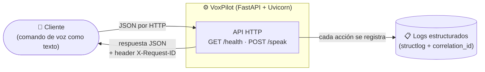
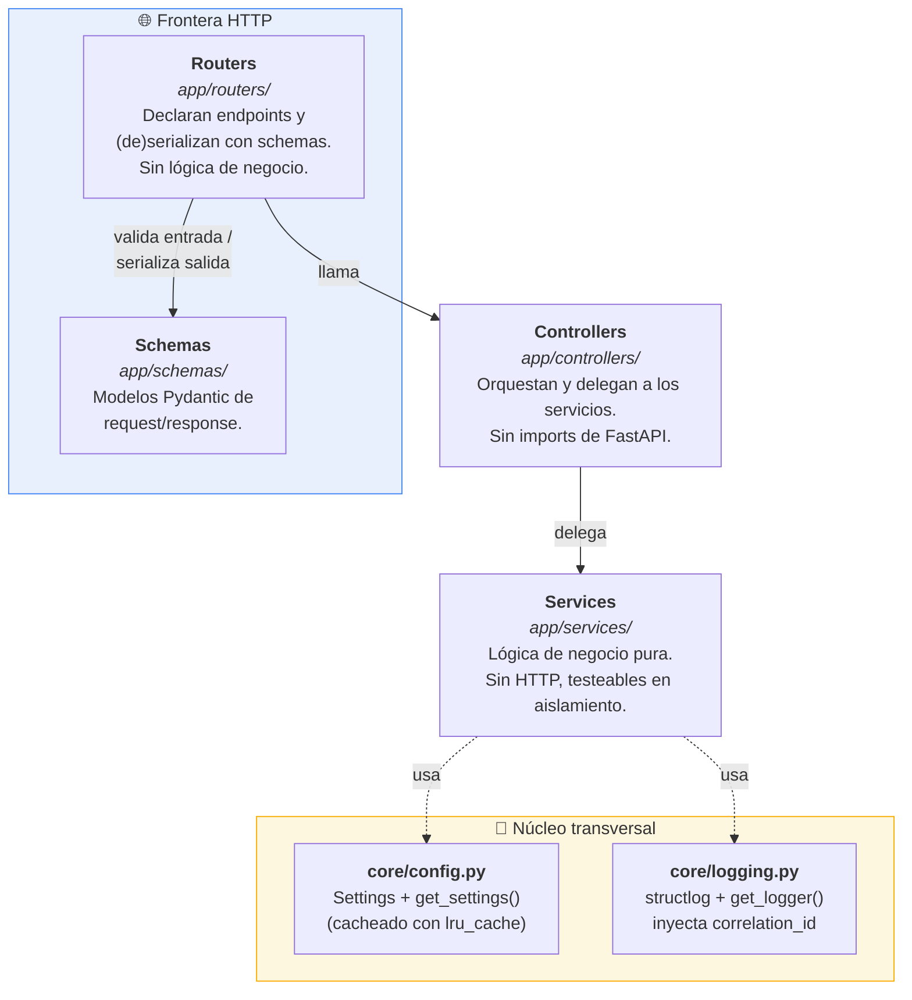
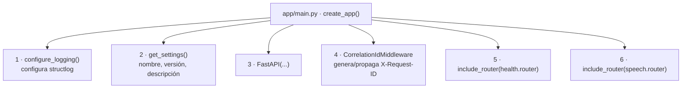
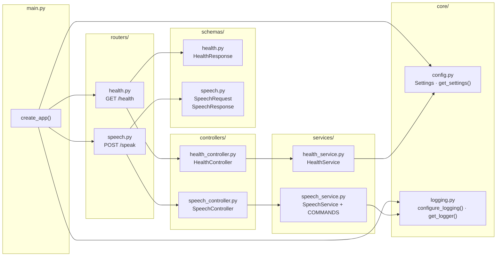
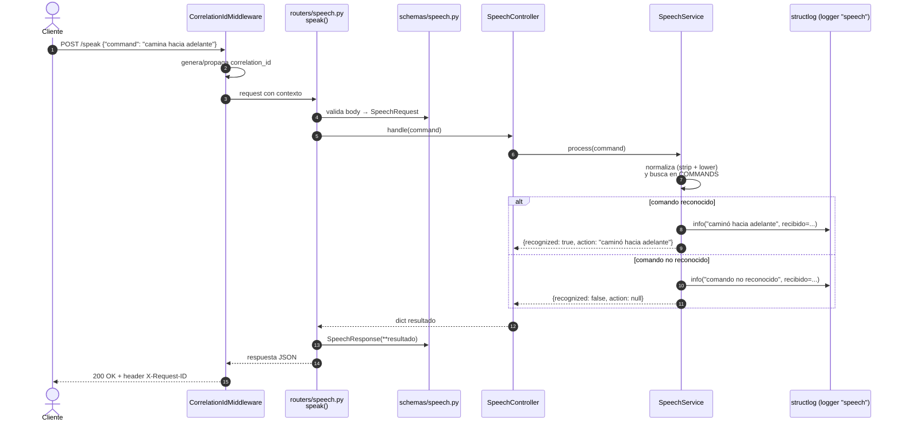
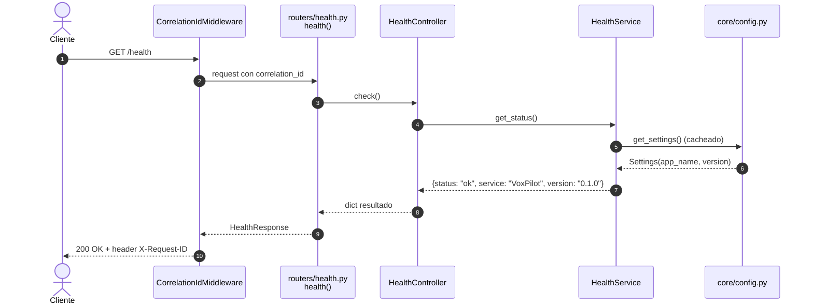
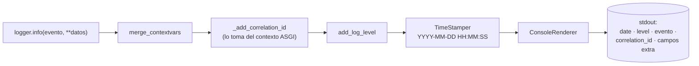
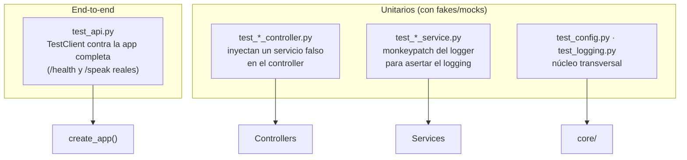
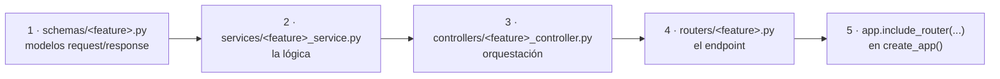

# Arquitectura de VoxPilot

**VoxPilot** es una API de piloto de acciones controlado por voz, construida con
**FastAPI**. Recibe comandos de voz (ya transcritos a texto) por HTTP, ejecuta la
acción correspondiente y la registra con logging estructurado.

Este documento describe la arquitectura completa del proyecto con diagramas.

---

## 1. Visión general del sistema



---

## 2. Arquitectura en capas

El proyecto sigue un flujo estricto **router → controller → service**, con
schemas Pydantic en la frontera HTTP. Cada capa tiene una responsabilidad
aislada y solo conoce a la capa inmediatamente inferior.



**Reglas de dependencia** (siempre hacia abajo, nunca al revés):

| Capa | Puede importar | No puede |
|---|---|---|
| `routers/` | schemas, controllers, `fastapi` | services directamente, lógica de negocio |
| `controllers/` | services | `fastapi`, schemas |
| `services/` | `core/` | `fastapi`, HTTP, capas superiores |
| `schemas/` | `pydantic` | todo lo demás |

---

## 3. Composición de la aplicación (`app/main.py`)

`create_app()` es la fábrica de la aplicación: configura el logging, lee la
configuración, registra el middleware y cablea los routers.



---

## 4. Módulos y dependencias reales

Grafo de imports entre los módulos del proyecto:



---

## 5. Flujo de una petición: `POST /speak`



## 6. Flujo de una petición: `GET /health`



---

## 7. Pipeline de logging estructurado

Todo log pasa por la cadena de procesadores de **structlog** configurada en
`core/logging.py`. El `correlation_id` lo aporta `asgi-correlation-id` por
request, de modo que cada línea de log se puede correlacionar con la petición
HTTP que la originó (y con el header `X-Request-ID` que recibe el cliente).



Reglas del proyecto: usar siempre `get_logger(<nombre>)`; nunca `print()` ni el
módulo `logging` de la stdlib directamente.

---

## 8. Estructura de archivos

```
voxpilot/
├── app/
│   ├── main.py                        # fábrica create_app() + middleware + routers
│   ├── core/
│   │   ├── config.py                  # Settings + get_settings() (lru_cache)
│   │   └── logging.py                 # structlog + correlation_id
│   ├── routers/
│   │   ├── health.py                  # GET /health
│   │   └── speech.py                  # POST /speak
│   ├── controllers/
│   │   ├── health_controller.py       # HealthController
│   │   └── speech_controller.py       # SpeechController
│   ├── services/
│   │   ├── health_service.py          # HealthService
│   │   └── speech_service.py          # SpeechService + mapa COMMANDS
│   └── schemas/
│       ├── health.py                  # HealthResponse
│       └── speech.py                  # SpeechRequest / SpeechResponse
├── tests/                             # un archivo por unidad bajo prueba
│   ├── test_api.py                    # end-to-end con TestClient
│   ├── test_config.py
│   ├── test_logging.py
│   ├── test_health_controller.py
│   ├── test_health_service.py
│   ├── test_speech_controller.py
│   └── test_speech_service.py
├── pyproject.toml                     # deps gestionadas con uv
├── uv.lock
└── CLAUDE.md                          # guía del proyecto
```

---

## 9. Estrategia de testing

Cada capa se prueba en aislamiento, más una suite end-to-end. La cobertura se
exige al **90 %** (`--cov-fail-under=90`).



---

## 10. Cómo se extiende (patrón para nuevas funcionalidades)

Para añadir una nueva capacidad se crea **un archivo por capa** y se registra el
router en `create_app()`:



Para añadir solo un **comando de voz nuevo**, basta con agregar una entrada al
mapa `COMMANDS` en `app/services/speech_service.py`:

```python
COMMANDS: dict[str, str] = {
    "camina hacia adelante": "caminó hacia adelante",
    # "nuevo comando": "acción registrada",
}
```

---

## Stack tecnológico

| Componente | Herramienta |
|---|---|
| Lenguaje | Python 3.12+ |
| Framework web | FastAPI |
| Servidor ASGI | Uvicorn |
| Gestión de entorno y deps | uv |
| Logging estructurado | structlog + asgi-correlation-id |
| Testing | pytest + pytest-cov + httpx (cobertura ≥ 90 %) |
